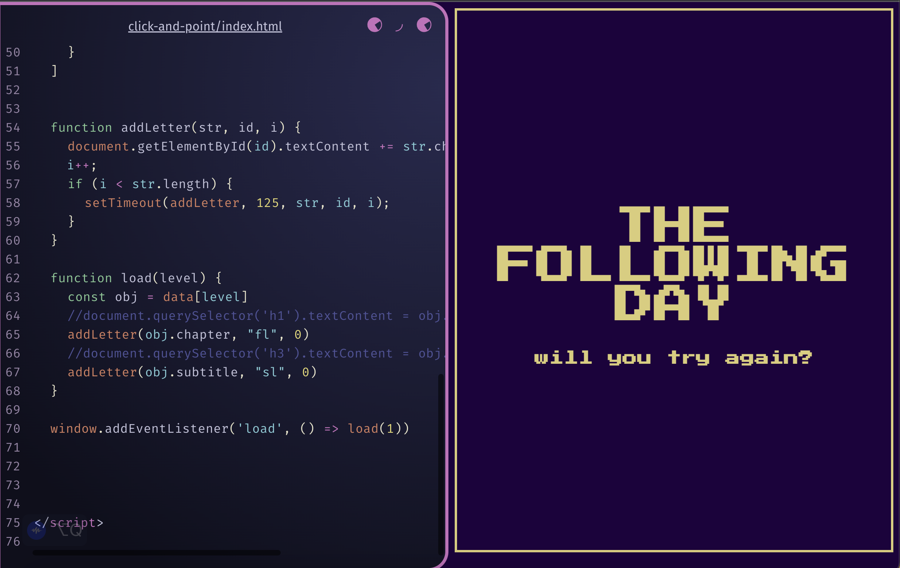

# click-and-point

[Link to project](https://beckaseifert.github.io/click-and-point/)

The fisrt of three different viewports to put down the frame work to build a point and click adventure game about the player trying to resurect their dead cat. This first viewport is the pages inbetween eacch of the different story image pages, and the end pages for the third viewport. I has text with a border, the when the page activates, the text appears letter by letter in an animation.
